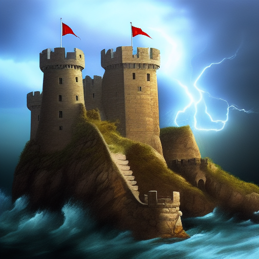
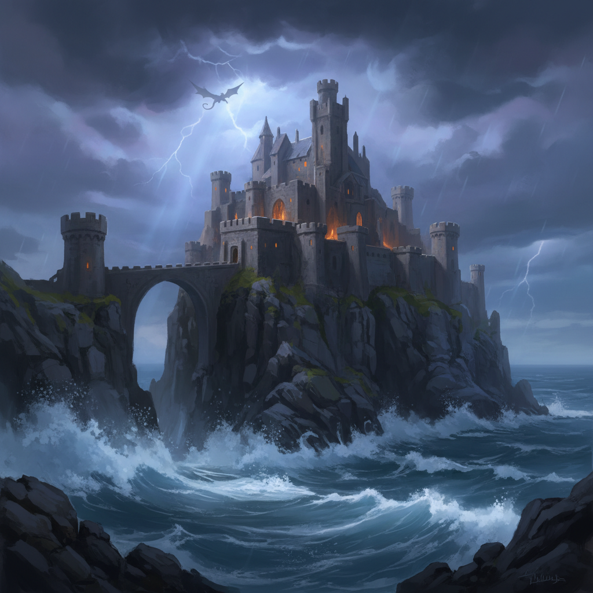

# Open Palette

Local-first AI image generation studio. Like OpenArt, but you own the stack.

Upload reference images, describe what you want, pick your model and backend, and generate. Compare outputs across multiple backends side-by-side. Swap between local GPU inference and cloud APIs with one click.

 

## Model Comparison

Same prompt across different backends — all generated through Open Palette:

> *"a golden retriever sitting in autumn leaves, warm sunlight, shallow depth of field, photorealistic"*

| SD 1.5 (512x512, local) | SDXL Q4 GGUF (1024x1024, local) | Juggernaut XL Q4 (1024x1024, local) |
|:---:|:---:|:---:|
|  |  |  |

| RealVisXL V4 Q4 (1024x1024, local) | Nano Banana / Gemini 2.5 Flash (cloud) |
|:---:|:---:|
|  |  |

> *"a medieval castle on a cliff overlooking a stormy ocean, dramatic lighting, digital painting, fantasy art"*

| SD 1.5 (local) | Juggernaut XL (local) | Nano Banana / Gemini (cloud) |
|:---:|:---:|:---:|
|  |  |  |

All local images generated on an RTX 3060 Ti (8GB VRAM) using GGUF quantized models.

## Quick Start

```bash
git clone https://github.com/toastmanAu/open-palette.git
cd open-palette
pip install -r requirements.txt
cp config.example.yaml config.yaml
python server.py
```

Open **http://localhost:7860** in your browser.

### Fastest path to generating images

**No GPU? No problem.** Enable a cloud backend:

1. Get a free API key from [Google AI Studio](https://aistudio.google.com/apikey)
2. Set it: `export GEMINI_API_KEY=your_key_here`
3. Run `python server.py` and select **gemini** backend

**Have an NVIDIA GPU?** Set up [ComfyUI](https://github.com/comfyanonymous/ComfyUI) and point Open Palette at it in `config.yaml`. Download GGUF quantized models to run SDXL-quality generation on 8GB VRAM.

## Features

- **Text-to-image** with up to 4 reference images (IP-Adapter support)
- **Compare mode** — run the same prompt across multiple backends/models side-by-side
- **Auto-model detection** — discovers installed ComfyUI models, shows unavailable ones greyed out
- **Per-model optimal defaults** — resolution, steps, CFG auto-tune when you switch models
- **GGUF quantized model support** — run SDXL on 8GB VRAM via ComfyUI-GGUF
- **Built-in tips guide** — prompt writing, CFG scale, model strengths
- **Settings page** — configure API keys, enable/disable backends, test connections from the UI
- **PNG metadata** — prompt, model, seed embedded in every generated image
- **Real-time progress** via WebSocket with polling fallback
- **Gallery** of previous generations with metadata
- **Save / download / use as reference** workflow
- **Responsive** — works on desktop and mobile

## Supported Backends

| Backend | Type | Cost | Notes |
|---------|------|------|-------|
| **ComfyUI** | Local | Free | Most flexible — supports checkpoints, GGUF, IP-Adapter, ControlNet |
| **Fooocus** | Local | Free | Simple setup, good defaults, image prompt support |
| **A1111 WebUI** | Local | Free | Mature ecosystem with extensions |
| **Gemini** | Cloud | Free tier | Nano Banana, Nano Banana Pro, Imagen 4 models |
| **HuggingFace** | Cloud | Free credits | Community models via Inference API |
| **Pollinations** | Cloud | Token required | Flux and Turbo models |
| **Stability AI** | Cloud | Paid | SDXL, Stable Image Core |
| **OpenAI** | Cloud | Paid | DALL-E 3, GPT Image 1 |
| **Replicate** | Cloud | Paid | Flux Pro, SDXL, and many more |

## Recommended Local Models (GGUF, 8GB VRAM)

These quantized models run on consumer GPUs via ComfyUI + [ComfyUI-GGUF](https://github.com/city96/ComfyUI-GGUF):

| Model | Size | Best For |
|-------|------|----------|
| SD 1.5 (checkpoint) | 4.0 GB | Fast drafts at 512x512 |
| SDXL Base Q4 (GGUF) | 1.4 GB | All-rounder at 1024x1024 |
| Juggernaut XL Q4 (GGUF) | 1.4 GB | Photorealism |
| RealVisXL V4 Q4 (GGUF) | 1.4 GB | Portraits and scenes |

GGUF models go in `ComfyUI/models/unet/`. Also need SDXL CLIP encoders in `ComfyUI/models/clip/` and SDXL VAE in `ComfyUI/models/vae/`.

## Configuration

Copy `config.example.yaml` to `config.yaml` and edit:

```yaml
backends:
  comfyui:
    enabled: true
    url: "http://192.168.68.102:8188"  # your ComfyUI instance

  gemini:
    enabled: true
    api_key: ""  # or set GEMINI_API_KEY env var
```

API keys can also be managed from the **Settings** page in the UI (`/settings`).

### Environment Variables

| Variable | Backend |
|----------|---------|
| `GEMINI_API_KEY` | Google Gemini / Imagen |
| `OPENAI_API_KEY` | OpenAI DALL-E |
| `STABILITY_API_KEY` | Stability AI |
| `HF_TOKEN` or `HUGGINGFACE_API_KEY` | HuggingFace |
| `REPLICATE_API_TOKEN` | Replicate |
| `POLLINATIONS_API_KEY` | Pollinations |

## Architecture

```
Browser (localhost:7860)
    |
    v
Open Palette (FastAPI + WebSocket)
    |
    +-- ComfyUI API (local GPU)
    +-- Fooocus API (local GPU)
    +-- A1111 API (local GPU)
    +-- Gemini API (cloud)
    +-- HuggingFace API (cloud)
    +-- ... other cloud APIs
```

All generation is async. The server submits jobs, tracks progress via WebSocket, and streams updates to the browser. Generated images are saved with full metadata (JSON sidecar + embedded PNG tEXt chunks).

## Requirements

- Python 3.10+
- For local generation: NVIDIA GPU with 6GB+ VRAM (8GB+ recommended)
- For cloud-only: no GPU needed

## License

MIT
