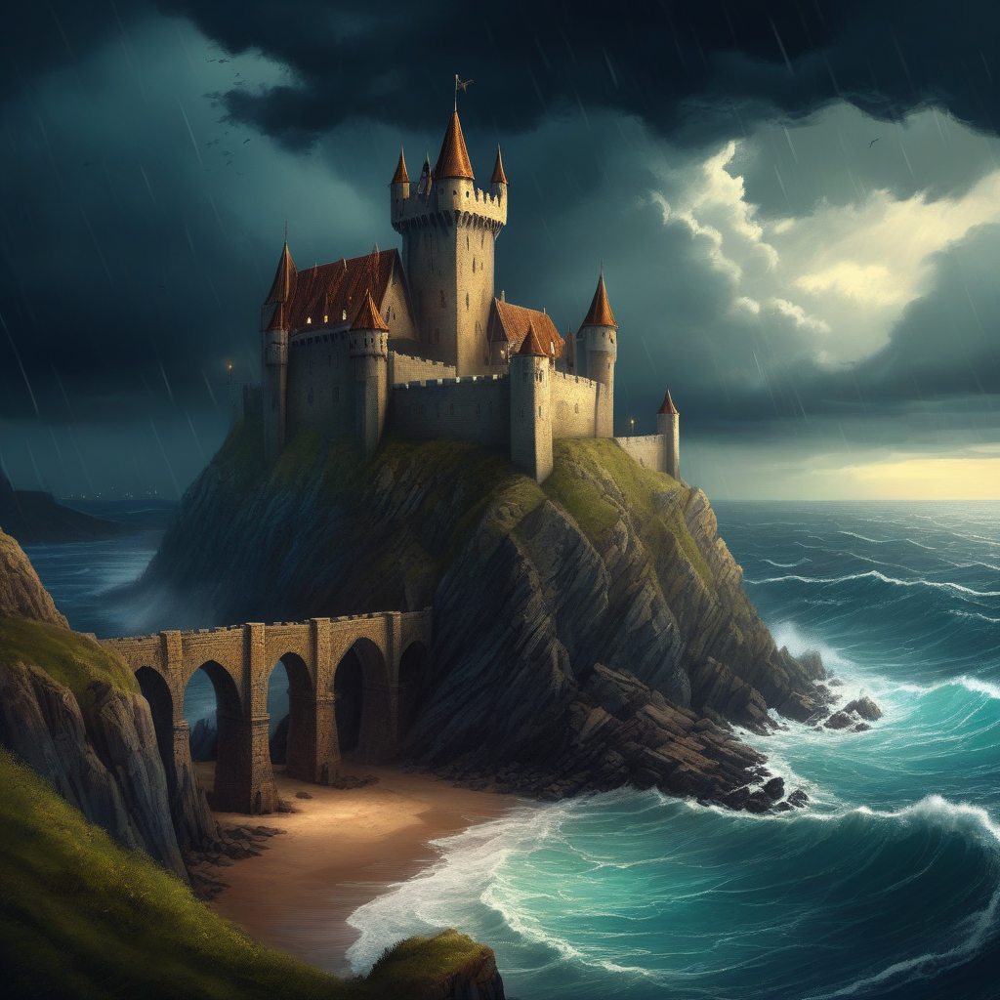
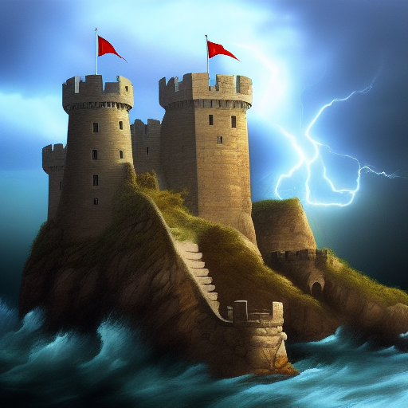
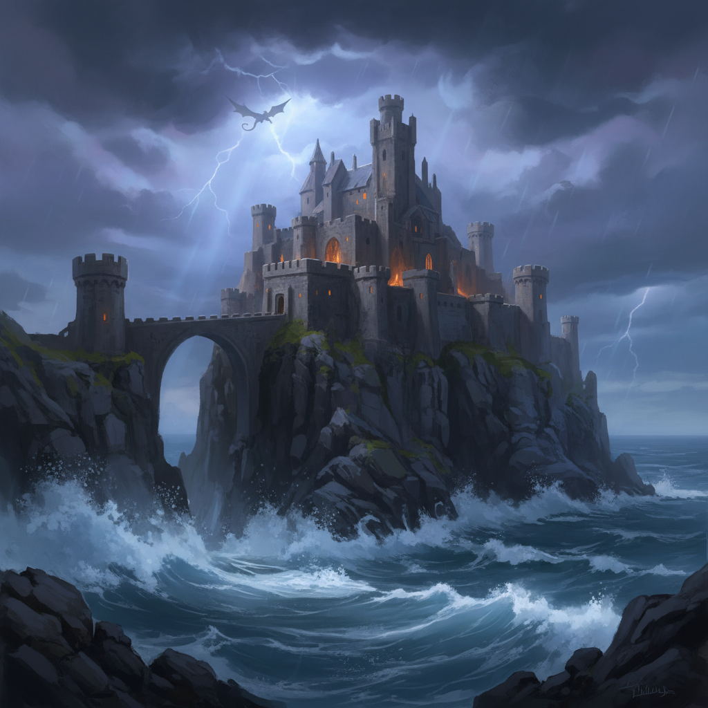

# Wyltek Studio

Local-first AI creative studio by [Wyltek Industries](https://github.com/toastmanAu). Generate images, cut frames from video, remove backgrounds, create narration, compose music, and build video content — all running on your own hardware, no cloud required.

 

## What's in the box

| Studio | What it does |
|--------|-------------|
| **Image Generator** | Text-to-image across 15+ local and cloud models. Compare them side-by-side. |
| **Frame Cutter** | Load any video file, scrub frame-by-frame, grab a frame as a PNG. No upload — reads from your filesystem directly. |
| **Image Tools** | Remove backgrounds (rembg), select objects to remove/replace by brush, rectangle, lasso, or SAM click-to-segment. |
| **TTS Studio** | Text-to-speech with Piper (7 voices, 40× realtime), Kokoro (11 voices), XTTS v2 (voice cloning), and Bark (expressive emotions). |
| **Music Studio** | MusicGen text-to-music, single/continuation/loop modes up to 180s. |
| **Video Studio** | AnimateDiff text-to-video via ComfyUI. 8fps, 2–6 second clips. |
| **Meme Forge** | Meme generator with templates, text overlays, and optional IP-Adapter conditioning. |
| **Infographic Builder** | Eight template-driven infographic types (hub-and-spoke, comparison, timeline, stats, quadrant, list, geographic, hierarchical) powered by SenseNova-U1-8B-MoT, with optional numbered image references and inline post-edit canvas. |
| **Projects** | Timeline compositor — drag clips, Ken Burns, xfade transitions, text overlays, narration + music mixing. |
| **File Manager** | Project-based storage with unsorted bin. |
| **Settings** | Configure backends, API keys, test connections. One-click model downloads. |

---

## Model Comparison

Same prompt across different backends — all generated through Wyltek Studio:

> *"a golden retriever sitting in autumn leaves, warm sunlight, shallow depth of field, photorealistic"*

| SD 1.5 (512x512, local) | SDXL Q4 GGUF (1024x1024, local) | Juggernaut XL Q4 (1024x1024, local) |
|:---:|:---:|:---:|
|  |  |  |

| RealVisXL V4 Q4 (1024x1024, local) | Nano Banana / Gemini 2.5 Flash (cloud) |
|:---:|:---:|
|  |  |

> *"a medieval castle on a cliff overlooking a stormy ocean, dramatic lighting, digital painting, fantasy art"*

| SD 1.5 (local) | Juggernaut XL (local) | Nano Banana / Gemini (cloud) |
|:---:|:---:|:---:|
|  |  |  |

All local images generated on an RTX 3060 Ti (8GB VRAM) using GGUF quantized models.

---

## Quick Start

### Option A: Docker (recommended)

```bash
git clone https://github.com/toastmanAu/wyltek-studio.git
cd wyltek-studio
cp config.example.yaml config.yaml

# Basic — just Wyltek Studio
docker compose up -d

# With Ollama for "OP my prompt" (CPU)
docker compose --profile ollama up -d
docker compose exec ollama ollama pull qwen2.5:14b
```

Open **http://localhost:7860** in your browser.

> **Docker + ComfyUI:** If ComfyUI runs on your host machine, use `http://host.docker.internal:8188` as the ComfyUI URL in config.yaml. If it's on another machine, use its IP directly.

### Option B: Native install

```bash
git clone https://github.com/toastmanAu/wyltek-studio.git
cd wyltek-studio
./install.sh     # checks prerequisites, creates venv, installs deps, sets up config
```

Or manually:

```bash
pip install -r requirements.txt
cp config.example.yaml config.yaml
python server.py
```

Open **http://localhost:7860** in your browser.

### Fastest path to generating images

**No GPU? No problem.** Enable a cloud backend:

1. Get a free API key from [Google AI Studio](https://aistudio.google.com/apikey)
2. Set it: `export GEMINI_API_KEY=your_key_here`
3. Run `python server.py`

**Have an NVIDIA GPU?** Set up [ComfyUI](https://github.com/comfyanonymous/ComfyUI) and point Wyltek Studio at it in `config.yaml`.

---

## Image Tools

### Background Removal

Runs entirely locally via [rembg](https://github.com/danielgatis/rembg) in a dedicated venv (`/data/venvs/rembg/`). No API calls after the first model download.

Five models available:

| Model | Best for |
|-------|----------|
| `u2net` | General purpose (default) |
| `u2net_human_seg` | Portraits and people |
| `isnet-general-use` | Stronger general removal |
| `birefnet-general` | Best quality, slower |
| `silueta` | Fast and lightweight |

Alpha matting option for clean hair and fur edges.

### Object Selection Tools

Four ways to select what to remove or replace:

| Tool | How it works |
|------|-------------|
| **Brush** | Freehand paint over the area |
| **Rectangle** | Drag to select a rectangular region |
| **Ellipse** | Drag to select an elliptical region |
| **Lasso** | Click to add polygon points, double-click to close |
| **SAM** (⚡) | Click anywhere on an object — SAM finds its exact boundary automatically |

SAM (Segment Anything, ViT-L) runs locally. The model (~1.2GB) is loaded once and kept in memory. On an RTX 3060 Ti, segmentation takes ~1 second per click.

### Frame Cutter → Image Tools workflow

1. Open **Frame Cutter**, load a video (reads from your filesystem — nothing uploaded)
2. Scrub to the frame you want with the slider or step buttons
3. Click **Grab Frame** → **Send to Image Tools**
4. The frame lands directly in Image Tools ready to process

### Object removal and inpainting

LaMa object removal and SD inpainting (for adding/replacing objects) are coming next. The selection tools (brush, rect, lasso, SAM) are already wired — the backends just need connecting.

---

## TTS Studio

| Engine | Voices | Speed | Notes |
|--------|--------|-------|-------|
| **Piper** | 7 | 40× realtime | Runs on CPU, very fast |
| **Kokoro** | 11 | 4× realtime | Higher quality |
| **XTTS v2** | Voice cloning | ~1× realtime | Upload a reference audio clip |
| **Bark** | Expressive | ~0.5× realtime | Emotions, laughter, non-speech sounds |

---

## Music Studio

Text-to-music via [MusicGen](https://github.com/facebookresearch/audiocraft) (small and medium models). Three modes:

- **Single** — generate a standalone clip (up to 30s)
- **Continuation** — extend an existing audio clip
- **Loop** — generate a seamlessly looping clip (up to 180s)

Runs on CPU (GPU optionally via CUDA_VISIBLE_DEVICES).

---

## Video Studio

Text-to-video via [AnimateDiff-Evolved](https://github.com/Kosinkadink/ComfyUI-AnimateDiff-Evolved) in ComfyUI. Uses SD 1.5 + motion module, 8fps, 2–6 second clips. Requires ComfyUI running with the AnimateDiff custom node and motion models installed.

---

## "OP My Prompt" — AI-Enhanced Prompts

The **OP my prompt** button uses a local LLM (via [Ollama](https://ollama.com)) to enhance your prompt before generation — adding lighting, composition, color guidance, and a negative prompt. Runs on CPU so your GPU stays free for image generation.

> **Human prompt:** "A Pokemon style cat"
>
> **OP'd prompt:** "A cute and detailed Pokémon-style cat character with vibrant colors, expressive eyes, and a playful pose. The background is a stylized forest scene with glowing leaves and soft lighting to emphasize the character."

Works with any Ollama-compatible model — configure in Settings.

### Optional: Enable "OP My Prompt"

```bash
# Install Ollama
curl -fsSL https://ollama.com/install.sh | sh

# Pull a model
ollama pull qwen2.5:14b    # Best quality, ~9GB RAM, 8-12s per enhancement
ollama pull qwen2.5:7b     # Faster, ~5GB RAM
```

Configure in Settings or `config.yaml`:

```yaml
prompt_optimizer:
  enabled: true
  ollama_url: "http://[::1]:11434"
  model: "qwen2.5:14b"
```

---

## Auto Image Scoring

Every generated image is automatically scored on 8 quality metrics: sharpness, saturation, brightness, color diversity, contrast, noise, edge density, and dynamic range. Scores are stored in SQLite and aggregated into per-model profiles over time.

---

## Supported Image Backends

| Backend | Type | Notes |
|---------|------|-------|
| **ComfyUI** | Local | Checkpoints, GGUF, LoRA, IP-Adapter, ControlNet |
| **Fooocus** | Local | Simple setup, good defaults |
| **A1111 WebUI** | Local | Mature ecosystem |
| **Gemini** | Cloud | Nano Banana, Nano Banana Pro, Imagen 4 |
| **HuggingFace** | Cloud | Community models via Inference API |
| **Pollinations** | Cloud | Flux and Turbo models |
| **Stability AI** | Cloud | SDXL, Stable Image Core |
| **OpenAI** | Cloud | DALL-E 3, GPT Image 1 |
| **Replicate** | Cloud | Flux Pro, SDXL, many more |

---

## Local Models

### Checkpoints

Place in `ComfyUI/models/checkpoints/`:

| Model | Size | Resolution | Best For |
|-------|------|-----------|----------|
| SD 1.5 | 4.0 GB | 512×512 | Fast drafts, stylised art |
| SDXL 1.0 | 6.5 GB | 1024×1024 | All-rounder |
| Juggernaut XL v9 | 6.7 GB | 1024×1024 | Photorealism, people, products |
| RealVisXL V4 | 6.5 GB | 1024×1024 | Portraits, architecture, nature |
| DreamShaper XL Turbo | 746 MB | 1024×1024 | Fast iteration, versatile style |

### GGUF Quantized Models (lower VRAM)

Place in `ComfyUI/models/unet/`. Requires [ComfyUI-GGUF](https://github.com/city96/ComfyUI-GGUF).

| Model | Size | VRAM | Best For |
|-------|------|------|----------|
| Flux.1 Dev Q4 | ~5.5 GB | 6 GB | SOTA quality, text rendering |
| Flux.1 Dev Q5 | ~7 GB | 8 GB | Higher fidelity |
| Flux.1 Schnell Q4 | ~5.5 GB | 6 GB | Ultra-fast (4 steps) |
| SDXL Lightning 4-step | ~5 GB | 7 GB | Fast, LoRA compatible |

Flux models also need T5-XXL encoder, CLIP-L, and Flux VAE in `ComfyUI/models/clip/` and `ComfyUI/models/vae/`.

### LoRA Style Models

Place in `ComfyUI/models/loras/`. Works with SDXL-based checkpoints and GGUF models.

---

## Configuration

Copy `config.example.yaml` to `config.yaml`:

```yaml
backends:
  comfyui:
    enabled: true
    url: "http://127.0.0.1:8188"

  gemini:
    enabled: true
    api_key: ""  # or set GEMINI_API_KEY env var
```

### Environment Variables

| Variable | Backend |
|----------|---------|
| `GEMINI_API_KEY` | Google Gemini / Imagen |
| `OPENAI_API_KEY` | OpenAI DALL-E |
| `STABILITY_API_KEY` | Stability AI |
| `HF_TOKEN` | HuggingFace |
| `REPLICATE_API_TOKEN` | Replicate |
| `POLLINATIONS_API_KEY` | Pollinations |

---

## Running as a System Service

```bash
mkdir -p ~/.config/systemd/user
cat > ~/.config/systemd/user/wyltek-studio.service << 'EOF'
[Unit]
Description=Wyltek Studio
After=network.target
[Service]
Type=simple
WorkingDirectory=/path/to/wyltek-studio
ExecStart=/usr/bin/python3 server.py
Restart=always
RestartSec=5
Environment=PYTHONUNBUFFERED=1
[Install]
WantedBy=default.target
EOF

systemctl --user daemon-reload
systemctl --user enable --now wyltek-studio
```

---

## Architecture

```
Browser (localhost:7860)
    │
    ▼
Wyltek Studio (FastAPI + WebSocket)
    │
    ├── Image Generator
    │     ├── ComfyUI API (local GPU — checkpoints, GGUF, LoRA, IP-Adapter)
    │     └── Cloud APIs (Gemini, OpenAI, Replicate, HuggingFace, …)
    │
    ├── Frame Cutter        — browser reads video from disk via blob URL
    │
    ├── Image Tools
    │     ├── rembg          — /data/venvs/rembg/ (dedicated venv)
    │     ├── SAM ViT-L      — ~/ComfyUI/models/sams/sam_vit_l_0b3195.pth
    │     └── LaMa / SD inpaint  — coming soon
    │
    ├── TTS Studio           — Piper, Kokoro, XTTS v2, Bark (CPU)
    ├── Music Studio         — MusicGen small/medium (CPU)
    ├── Video Studio         — AnimateDiff via ComfyUI (GPU)
    └── Projects             — ffmpeg-python timeline renderer
```

All generation is async. The server submits jobs and streams progress to the browser via WebSocket. Generated images are saved with full metadata (JSON sidecar + embedded PNG tEXt chunks).

---

## Requirements

- Python 3.10+
- For local image generation: NVIDIA GPU with 6GB+ VRAM (8GB+ recommended)
- For background removal and SAM: CPU is fine (GPU accelerates SAM if available)
- For cloud-only image generation: no GPU needed

---

## Infographic Builder

Template-driven infographic page at `/studio/infographic`, powered by
SenseNova-U1-8B-MoT. Eight built-in templates, optional numbered image
references (`[Image 1]`, `[Image 2]`, …), draft (~73s) / final (~5min)
tier toggle, and an inline post-edit canvas that lets you drop, resize,
and paste PNG layers over the rendered output, then save the composite
as a new entry in your render history.

### Setup

```bash
./scripts/setup-sensenova.sh
```

Detects your platform (Linux+ROCm, Linux+CUDA, macOS Apple Silicon),
creates `/data/venvs/sensenova-u1`, installs the right torch wheel,
clones the SenseNova-U1 repo, and pulls weights via `huggingface-cli`
(50-step + 8-step preview, ~33GB each). After it finishes, export the
four `SENSENOVA_*` env vars it prints into your shell or systemd
override.

### Hardware matrix

| Platform | Status |
|---|---|
| Linux + ROCm 7.2+, 24GB VRAM | Verified (RX 7900 XTX) |
| Linux + CUDA 12.x, 24GB+ VRAM | Best-effort (community-verified) |
| macOS Apple Silicon, 32GB+ unified | Best-effort (community-verified) |
| Anything else | Unsupported |

### Custom templates

Drop a JSON file into `templates/infographics/` matching
`studio/infographics_schema.json`. Hot-reloaded on page refresh — no
server restart needed. The schema supports `text`, `image_ref`, `color`,
`enum`, and `list` (composite) slot types.

### Known limits

- **Concurrent renders OOM the GPU.** Stop ComfyUI before rendering on
  shared-GPU hardware. The page surfaces this with a precheck banner.
- **Post-edit canvas (V1-canvas)** supports drop, move, resize, paste,
  and save composite. Region-select to system-clipboard for a GIMP
  round-trip is a v1.5 feature — the workaround is to download the
  composite, edit in GIMP, and drop the result back onto the canvas.
- **Image-ref output size** auto-derives from Image 1 when refs are
  present (per SenseNova's `smart_resize`). The aspect dropdown greys
  out in that case.
- **A3B-MoT smaller variant** (3B-active MoE) is not yet supported. The
  current install is 8B-MoT only (~33GB BF16). A3B support is a
  follow-up for lower-VRAM hardware tiers.

For the full design, see
[`docs/superpowers/specs/2026-05-05-infographic-builder-design.md`](docs/superpowers/specs/2026-05-05-infographic-builder-design.md).

---

## License

MIT
